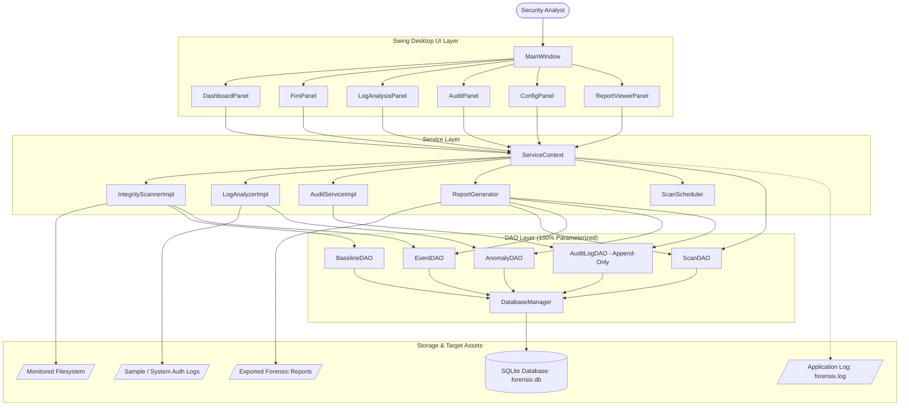

# FORENSIX — System Architecture Diagram

```mermaid
graph TD
    User([Security Analyst])
    
    subgraph UI_Layer ["Swing Desktop UI Layer"]
        MW[MainWindow]
        DP[DashboardPanel]
        FP[FimPanel]
        LP[LogAnalysisPanel]
        AP[AuditPanel]
        CP[ConfigPanel]
        RP[ReportViewerPanel]
    end

    subgraph Service_Layer ["Service Layer"]
        SC[ServiceContext]
        IS[IntegrityScannerImpl]
        LA[LogAnalyzerImpl]
        AS[AuditServiceImpl]
        RG[ReportGenerator]
        SS[ScanScheduler]
    end

    subgraph DAO_Layer ["DAO Layer (100% Parameterized)"]
        BD[BaselineDAO]
        SD[ScanDAO]
        ED[EventDAO]
        AD[AnomalyDAO]
        ALD[AuditLogDAO - Append-Only]
        DM[DatabaseManager]
    end

    subgraph External_Storage ["Storage & Target Assets"]
        DB[(SQLite Database: forensix.db)]
        FS[/Monitored Filesystem/]
        LF[/Sample / System Auth Logs/]
        RF[/Exported Forensic Reports/]
        AL[/Application Log: forensix.log/]
    end

    User --> MW
    MW --> DP & FP & LP & AP & CP & RP
    DP & FP & LP & AP & CP & RP --> SC

    SC --> IS & LA & AS & RG & SS
    
    IS --> FS
    LA --> LF
    RG --> RF
    
    IS --> BD & ED
    LA --> AD
    AS --> ALD
    RG --> SD & ED & AD & ALD
    SC --> SD

    BD & SD & ED & AD & ALD --> DM
    DM --> DB
    SC -.-> AL
```
