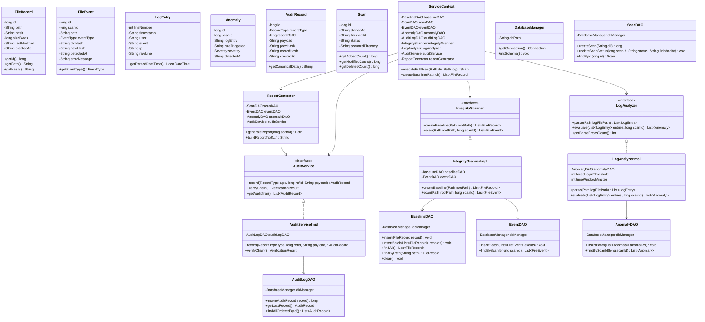

# FORENSIX — Class Diagram

```mermaid
classDiagram
    direction TB

    %% Model Layer
    class FileRecord {
        -long id
        -String path
        -String hash
        -long sizeBytes
        -String lastModified
        -String createdAt
        +getId() long
        +getPath() String
        +getHash() String
    }

    class FileEvent {
        -long id
        -long scanId
        -String path
        -EventType eventType
        -String oldHash
        -String newHash
        -String detectedAt
        -String errorMessage
        +getEventType() EventType
    }

    class LogEntry {
        -int lineNumber
        -String timestamp
        -String user
        -String event
        -String ip
        -String rawLine
        +getParsedDateTime() LocalDateTime
    }

    class Anomaly {
        -long id
        -long scanId
        -String logEntry
        -String ruleTriggered
        -Severity severity
        -String detectedAt
    }

    class AuditRecord {
        -long id
        -RecordType recordType
        -long recordRefId
        -String payload
        -String prevHash
        -String recordHash
        -String createdAt
        +getCanonicalData() String
    }

    class Scan {
        -long id
        -String startedAt
        -String finishedAt
        -String status
        -String scannedDirectory
        +getAddedCount() long
        +getModifiedCount() long
        +getDeletedCount() long
    }

    %% Service Layer
    class IntegrityScanner {
        <<interface>>
        +createBaseline(Path rootPath) List~FileRecord~
        +scan(Path rootPath, long scanId) List~FileEvent~
    }

    class IntegrityScannerImpl {
        -BaselineDAO baselineDAO
        -EventDAO eventDAO
        +createBaseline(Path rootPath) List~FileRecord~
        +scan(Path rootPath, long scanId) List~FileEvent~
    }

    class LogAnalyzer {
        <<interface>>
        +parse(Path logFilePath) List~LogEntry~
        +evaluate(List~LogEntry~ entries, long scanId) List~Anomaly~
        +getParseErrorsCount() int
    }

    class LogAnalyzerImpl {
        -AnomalyDAO anomalyDAO
        -int failedLoginThreshold
        -int timeWindowMinutes
        +parse(Path logFilePath) List~LogEntry~
        +evaluate(List~LogEntry~ entries, long scanId) List~Anomaly~
    }

    class AuditService {
        <<interface>>
        +record(RecordType type, long refId, String payload) AuditRecord
        +verifyChain() VerificationResult
        +getAuditTrail() List~AuditRecord~
    }

    class AuditServiceImpl {
        -AuditLogDAO auditLogDAO
        +record(RecordType type, long refId, String payload) AuditRecord
        +verifyChain() VerificationResult
    }

    class ReportGenerator {
        -ScanDAO scanDAO
        -EventDAO eventDAO
        -AnomalyDAO anomalyDAO
        -AuditService auditService
        +generateReport(long scanId) Path
        +buildReportText(...) String
    }

    class ServiceContext {
        -BaselineDAO baselineDAO
        -ScanDAO scanDAO
        -EventDAO eventDAO
        -AnomalyDAO anomalyDAO
        -AuditLogDAO auditLogDAO
        -IntegrityScanner integrityScanner
        -LogAnalyzer logAnalyzer
        -AuditService auditService
        -ReportGenerator reportGenerator
        +executeFullScan(Path dir, Path log) Scan
        +createBaseline(Path dir) List~FileRecord~
    }

    %% DAO Layer
    class DatabaseManager {
        -String dbPath
        +getConnection() Connection
        +initSchema() void
    }

    class BaselineDAO {
        -DatabaseManager dbManager
        +insert(FileRecord record) void
        +insertBatch(List~FileRecord~ records) void
        +findAll() List~FileRecord~
        +findByPath(String path) FileRecord
        +clear() void
    }

    class ScanDAO {
        -DatabaseManager dbManager
        +createScan(String dir) long
        +updateScanStatus(long scanId, String status, String finishedAt) void
        +findById(long id) Scan
    }

    class EventDAO {
        -DatabaseManager dbManager
        +insertBatch(List~FileEvent~ events) void
        +findByScanId(long scanId) List~FileEvent~
    }

    class AnomalyDAO {
        -DatabaseManager dbManager
        +insertBatch(List~Anomaly~ anomalies) void
        +findByScanId(long scanId) List~Anomaly~
    }

    class AuditLogDAO {
        -DatabaseManager dbManager
        +insert(AuditRecord record) long
        +getLastRecord() AuditRecord
        +findAllOrderedById() List~AuditRecord~
    }

    IntegrityScanner <|.. IntegrityScannerImpl
    LogAnalyzer <|.. LogAnalyzerImpl
    AuditService <|.. AuditServiceImpl

    IntegrityScannerImpl --> BaselineDAO
    IntegrityScannerImpl --> EventDAO
    LogAnalyzerImpl --> AnomalyDAO
    AuditServiceImpl --> AuditLogDAO
    ReportGenerator --> AuditService

    ServiceContext --> IntegrityScanner
    ServiceContext --> LogAnalyzer
    ServiceContext --> AuditService
    ServiceContext --> ReportGenerator
```
