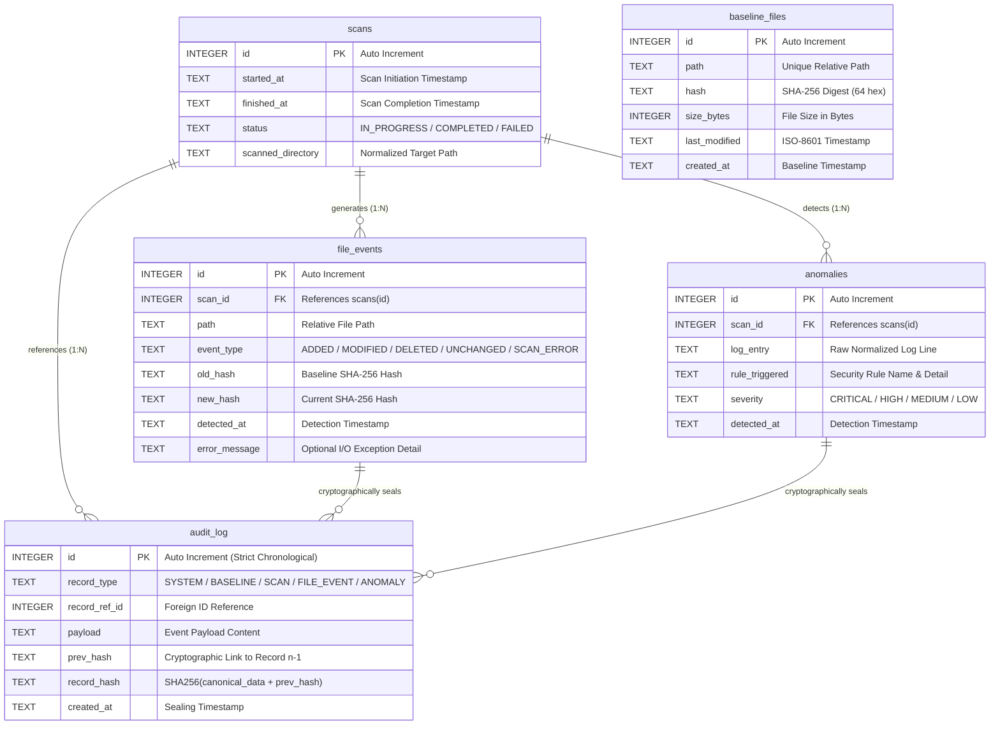

# FORENSIX — Database Entity-Relationship (ER) Diagram

```mermaid
erDiagram
    scans ||--o{ file_events : "generates (1:N)"
    scans ||--o{ anomalies : "detects (1:N)"
    scans ||--o{ audit_log : "references (1:N)"
    file_events ||--o{ audit_log : "cryptographically seals"
    anomalies ||--o{ audit_log : "cryptographically seals"

    baseline_files {
        INTEGER id PK "Auto Increment"
        TEXT path "Unique Relative Path"
        TEXT hash "SHA-256 Digest (64 hex)"
        INTEGER size_bytes "File Size in Bytes"
        TEXT last_modified "ISO-8601 Timestamp"
        TEXT created_at "Baseline Timestamp"
    }

    scans {
        INTEGER id PK "Auto Increment"
        TEXT started_at "Scan Initiation Timestamp"
        TEXT finished_at "Scan Completion Timestamp"
        TEXT status "IN_PROGRESS / COMPLETED / FAILED"
        TEXT scanned_directory "Normalized Target Path"
    }

    file_events {
        INTEGER id PK "Auto Increment"
        INTEGER scan_id FK "References scans(id)"
        TEXT path "Relative File Path"
        TEXT event_type "ADDED / MODIFIED / DELETED / UNCHANGED / SCAN_ERROR"
        TEXT old_hash "Baseline SHA-256 Hash"
        TEXT new_hash "Current SHA-256 Hash"
        TEXT detected_at "Detection Timestamp"
        TEXT error_message "Optional I/O Exception Detail"
    }

    anomalies {
        INTEGER id PK "Auto Increment"
        INTEGER scan_id FK "References scans(id)"
        TEXT log_entry "Raw Normalized Log Line"
        TEXT rule_triggered "Security Rule Name & Detail"
        TEXT severity "CRITICAL / HIGH / MEDIUM / LOW"
        TEXT detected_at "Detection Timestamp"
    }

    audit_log {
        INTEGER id PK "Auto Increment (Strict Chronological)"
        TEXT record_type "SYSTEM / BASELINE / SCAN / FILE_EVENT / ANOMALY"
        INTEGER record_ref_id "Foreign ID Reference"
        TEXT payload "Event Payload Content"
        TEXT prev_hash "Cryptographic Link to Record n-1"
        TEXT record_hash "SHA256(canonical_data + prev_hash)"
        TEXT created_at "Sealing Timestamp"
    }
```
