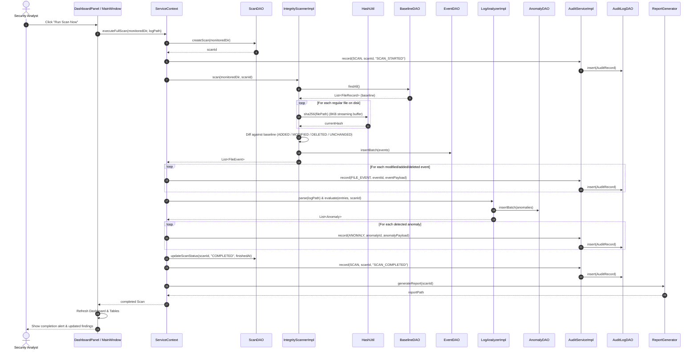

# FORENSIX — Run Scan Sequence Diagram

```mermaid
sequenceDiagram
    autonumber
    actor Analyst as Security Analyst
    participant UI as DashboardPanel / MainWindow
    participant SC as ServiceContext
    participant SD as ScanDAO
    participant IS as IntegrityScannerImpl
    participant HU as HashUtil
    participant BD as BaselineDAO
    participant ED as EventDAO
    participant LA as LogAnalyzerImpl
    participant AD as AnomalyDAO
    participant AS as AuditServiceImpl
    participant ALD as AuditLogDAO
    participant RG as ReportGenerator

    Analyst->>UI: Click "Run Scan Now"
    UI->>SC: executeFullScan(monitoredDir, logPath)
    SC->>SD: createScan(monitoredDir)
    SD-->>SC: scanId
    SC->>AS: record(SCAN, scanId, "SCAN_STARTED")
    AS->>ALD: insert(AuditRecord)
    
    SC->>IS: scan(monitoredDir, scanId)
    IS->>BD: findAll()
    BD-->>IS: List<FileRecord> (baseline)
    loop For each regular file on disk
        IS->>HU: sha256(filePath) (8KB streaming buffer)
        HU-->>IS: currentHash
    end
    IS->>IS: Diff against baseline (ADDED / MODIFIED / DELETED / UNCHANGED)
    IS->>ED: insertBatch(events)
    IS-->>SC: List<FileEvent>

    loop For each modified/added/deleted event
        SC->>AS: record(FILE_EVENT, eventId, eventPayload)
        AS->>ALD: insert(AuditRecord)
    end

    SC->>LA: parse(logPath) & evaluate(entries, scanId)
    LA->>AD: insertBatch(anomalies)
    LA-->>SC: List<Anomaly>

    loop For each detected anomaly
        SC->>AS: record(ANOMALY, anomalyId, anomalyPayload)
        AS->>ALD: insert(AuditRecord)
    end

    SC->>SD: updateScanStatus(scanId, "COMPLETED", finishedAt)
    SC->>AS: record(SCAN, scanId, "SCAN_COMPLETED")
    AS->>ALD: insert(AuditRecord)

    SC->>RG: generateReport(scanId)
    RG-->>SC: reportPath

    SC-->>UI: completed Scan
    UI->>UI: Refresh Dashboard & Tables
    UI-->>Analyst: Show completion alert & updated findings
```
