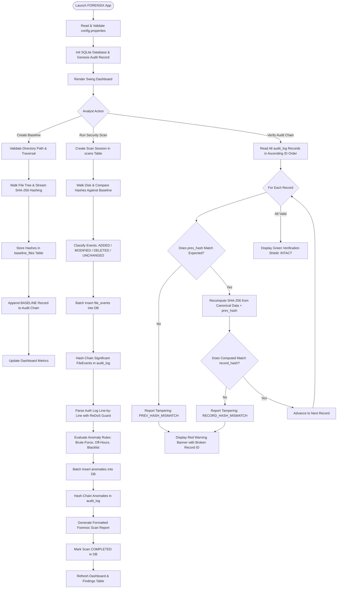

# FORENSIX — Process Flow & Workflow Diagram

```mermaid
flowchart TD
    Start([Launch FORENSIX App]) --> LoadConfig[Read & Validate config.properties]
    LoadConfig --> InitDB[Init SQLite Database & Genesis Audit Record]
    InitDB --> ShowUI[Render Swing Dashboard]

    ShowUI --> Choice{Analyst Action}

    %% Baseline Flow
    Choice -->|Create Baseline| ValDir1[Validate Directory Path & Traversal]
    ValDir1 --> Walk1[Walk File Tree & Stream SHA-256 Hashing]
    Walk1 --> StoreBase[Store Hashes in baseline_files Table]
    StoreBase --> AuditBase[Append BASELINE Record to Audit Chain]
    AuditBase --> RefreshDash1[Update Dashboard Metrics]

    %% Scan Flow
    Choice -->|Run Security Scan| CreateScan[Create Scan Session in scans Table]
    CreateScan --> DiffFiles[Walk Disk & Compare Hashes Against Baseline]
    DiffFiles --> ClassifyEvents[Classify Events: ADDED / MODIFIED / DELETED / UNCHANGED]
    ClassifyEvents --> StoreEvents[Batch Insert file_events into DB]
    StoreEvents --> ChainEvents[Hash-Chain Significant FileEvents in audit_log]
    
    ChainEvents --> ParseLogs[Parse Auth Log Line-by-Line with ReDoS Guard]
    ParseLogs --> EvalRules[Evaluate Anomaly Rules: Brute-Force, Off-Hours, Blacklist]
    EvalRules --> StoreAnom[Batch Insert anomalies into DB]
    StoreAnom --> ChainAnom[Hash-Chain Anomalies in audit_log]
    
    ChainAnom --> GenReport[Generate Formatted Forensic Scan Report]
    GenReport --> UpdateScan[Mark Scan COMPLETED in DB]
    UpdateScan --> RefreshDash2[Refresh Dashboard & Findings Table]

    %% Verify Flow
    Choice -->|Verify Audit Chain| ReadChain[Read All audit_log Records in Ascending ID Order]
    ReadChain --> LoopCheck{For Each Record}
    LoopCheck --> CheckPrev{Does prev_hash Match Expected?}
    CheckPrev -->|No| FlagTamper1[Report Tampering: PREV_HASH_MISMATCH]
    CheckPrev -->|Yes| RecomputeHash[Recompute SHA-256 from Canonical Data + prev_hash]
    RecomputeHash --> CheckContent{Does Computed Match record_hash?}
    CheckContent -->|No| FlagTamper2[Report Tampering: RECORD_HASH_MISMATCH]
    CheckContent -->|Yes| NextRecord[Advance to Next Record]
    NextRecord --> LoopCheck
    LoopCheck -->|All Valid| ValidResult[Display Green Verification Shield: INTACT]
    FlagTamper1 --> RedAlert[Display Red Warning Banner with Broken Record ID]
    FlagTamper2 --> RedAlert
```
